# Pneumatic Gripper FEA Design Study

A nonlinear finite-element design study of a pneumatically actuated gripper, developed from an existing SolidWorks mechanism and evaluated in ANSYS Mechanical.

> **Design path:** Baseline → Case A1 Contact Interface Correction → Case A2 Topology-Informed Jaw Plate Redesign

## Key Results

The final A2 design reduced the jaw-plate mass from **40.10 g to 31.198 g per part (-22.2%)** while preserving approximately the same jaw-plate stress as the original baseline (**8.9373 MPa → 8.9109 MPa**).

Relative to Case A1, the final A2 full-assembly validation showed:

- **49.2% lower** maximum contact pressure
- **134.0% higher** total contact area
- **31.6% lower** global maximum equivalent stress
- **46.9% lower** global maximum principal stress
- only **2.65% change** in actuator reaction force

These results were obtained after returning the redesigned jaw plate to the complete nonlinear gripper model rather than validating the topology study in isolation.

---

## Project Overview

The gripper was originally designed in SolidWorks for a robotics application. It clamps a hollow **150 × 150 × 150 mm** cube using a pneumatic actuator and a multi-link mechanism.

<p align="center">
  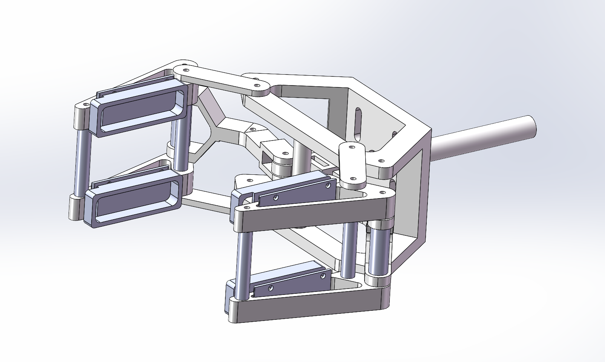
</p>

<p align="center"><em>Baseline gripper assembly developed in SolidWorks.</em></p>

The complete assembly was modeled in ANSYS Mechanical with:

- prescribed actuator displacement of **-28.8 mm**
- **Large Deflection = On**
- rigid target cube
- frictionless jaw-block-to-cube contact
- revolute joints at mechanism pivots
- a translational joint for the actuator rod
- homogenized isotropic FDM PLA for printed structural parts

### PLA material model

| Property | Value |
|---|---:|
| Young's modulus | 2.0 GPa |
| Poisson's ratio | 0.35 |
| Density | 1240 kg/m³ |

For the full setup and design workflow, see [docs/methodology.md](docs/methodology.md).

---

## 1. Baseline Characterization

The baseline study established the gripping response, stress field, contact behavior, and component load paths.

The mechanism first reached a four-contact gripping state at approximately **-22.5 mm** actuator displacement and became substantially stiffer toward the end of travel.

### Baseline production results

| Metric | Baseline |
|---|---:|
| Actuator reaction force | **256.67 N** |
| Max equivalent stress | **48.007 MPa** |
| Max principal stress | **57.06 MPa** |
| Max contact pressure | **19.779 MPa** |
| Jaw plate mass / part | **40.10 g** |
| Jaw plate max equivalent stress | **8.9373 MPa** |

<p align="center">
  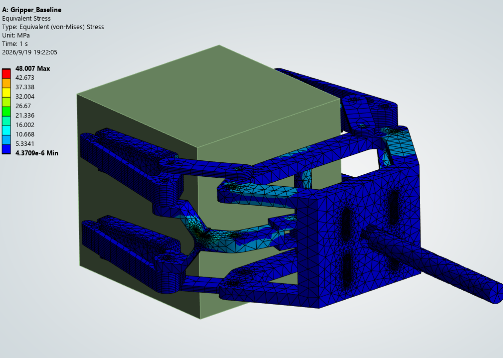
</p>

<p align="center"><em>Baseline full-assembly equivalent stress at the final -28.8 mm actuator displacement.</em></p>

### Component screening

The baseline model was also used to decide which parts were suitable for redesign.

- **Jaw Plate:** low stress relative to its mass, making it a good lightweighting candidate.
- **Actuation Link:** localized high stress around the Y-fork / pivot region, so aggressive material removal was avoided.
- **Mounting Frame:** large absolute mass-reduction opportunity, but excluded from the final project scope to keep the study focused.

<p align="center">
  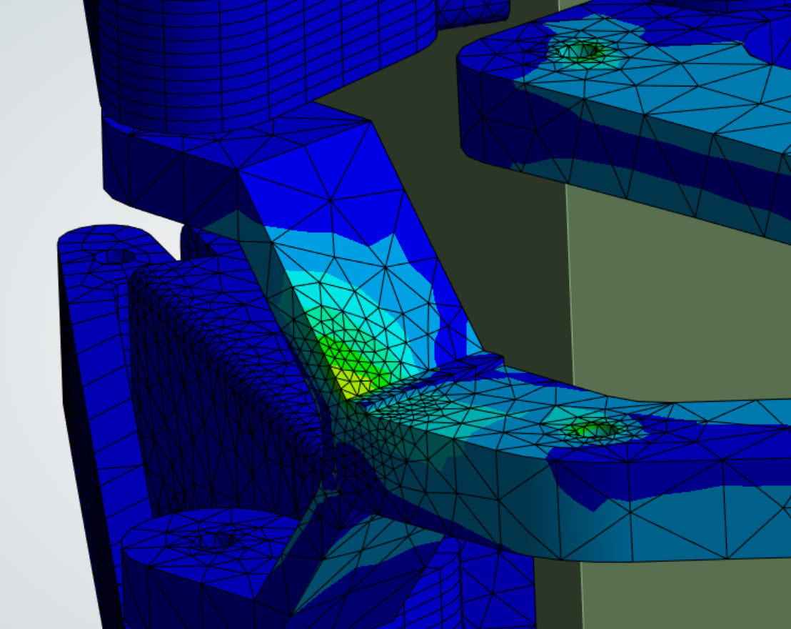
</p>

<p align="center"><em>Localized stress concentration around the actuation-link Y-fork / pivot region used during component screening.</em></p>

---

## 2. Mesh Convergence

A four-level mesh convergence study was performed at the final **-28.8 mm** gripping displacement.

| Mesh | Nodes | Elements | Reaction Force (N) | Max Eq. Stress (MPa) | Max Principal Stress (MPa) | Max Contact Pressure (MPa) |
|---|---:|---:|---:|---:|---:|---:|
| M0 | 115,014 | 55,882 | 257.22 | 47.865 | 61.712 | 19.812 |
| M1 | 128,372 | 62,989 | 257.06 | 48.659 | 62.150 | 19.826 |
| **M2** | **168,478** | **84,428** | **256.67** | **48.007** | **57.060** | **19.779** |
| M3 | 219,611 | 113,578 | 256.28 | 49.724 | 58.151 | 19.767 |

**M2** was selected as the production mesh. Relative to M3, the reaction-force difference is approximately **0.15%**, while the equivalent-stress difference is approximately **3.45%**.

<p align="center">
  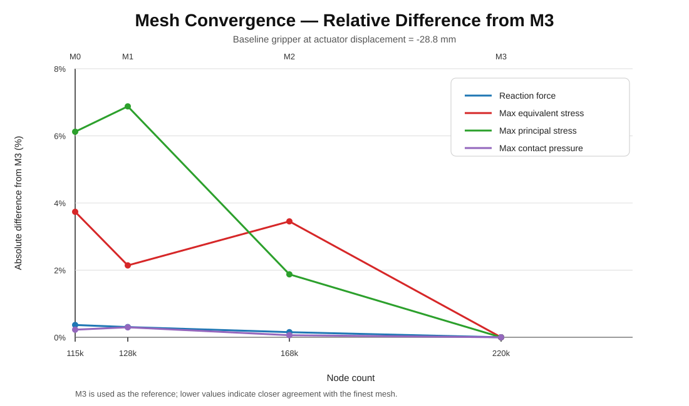
</p>

<p align="center"><em>Mesh-convergence plot showing the relative deviation of the main response quantities from the finest M3 mesh.</em></p>

---

## 3. Case A1 — Contact Interface Correction

Inspection of the deformed baseline configuration showed approximately **5.3°** contact-face misalignment near the final gripping position.

A full 5.3° geometric correction reduced the available closure too much because the actuator was already close to its physical stroke limit. A reduced **3° wedge correction** was therefore adopted.

### Contact-block geometry correction

<table>
<tr>
<td width="50%" valign="top">
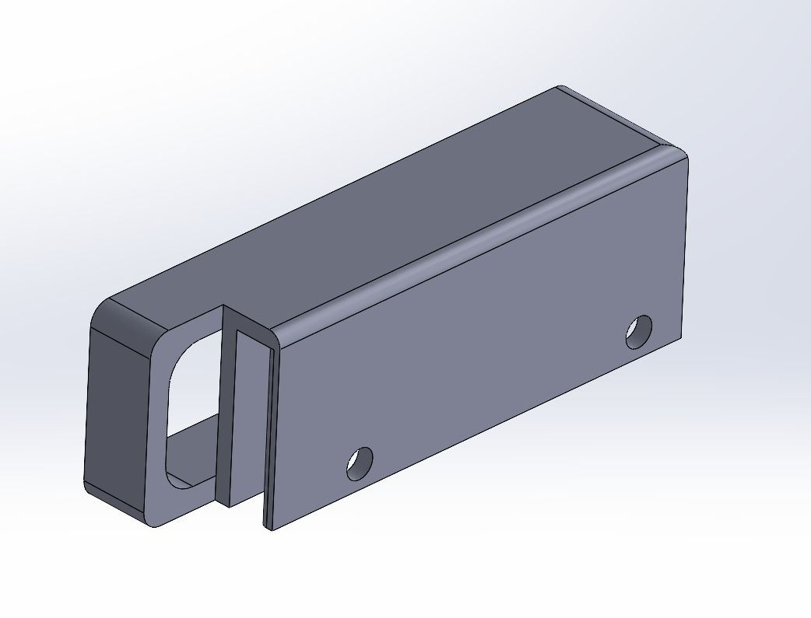
</td>
<td width="50%" valign="top">
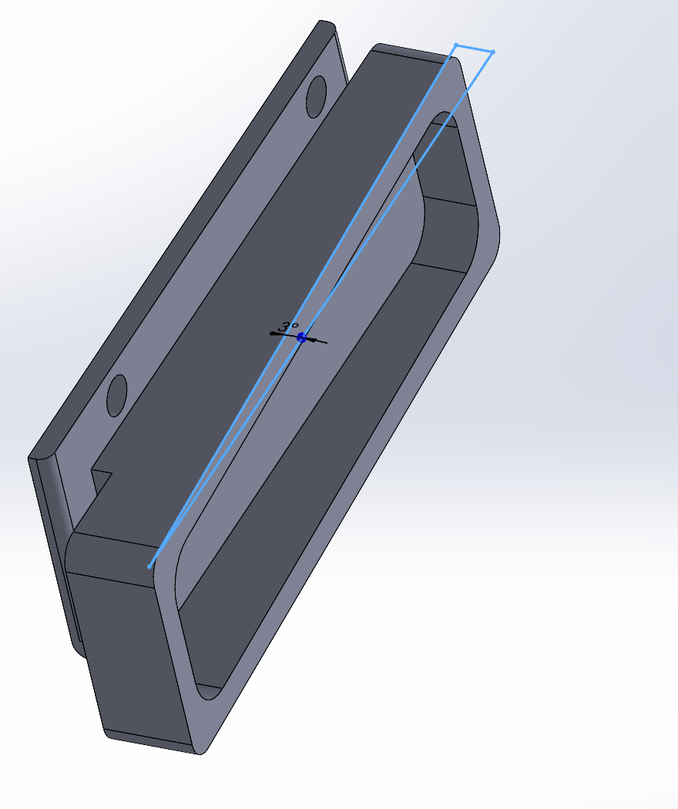
</td>
</tr>
<tr>
<td align="center"><strong>Baseline contact block</strong><br><em>Original contact-face geometry</em></td>
<td align="center"><strong>Case A1 contact block</strong><br><em>3° wedge correction</em></td>
</tr>
</table>

The A1 change was implemented as a geometric correction to the jaw contact block. The corrected block geometry was retained in the subsequent Final A2 assembly.

### A1 nonlinear solver setup

- Block-cube contact: **Frictionless**
- Contact stabilization damping factor: **0.1**
- Initial / minimum / maximum substeps: **100 / 20 / 2000**
- Maximum equilibrium iterations per substep: **50**
- Large Deflection: **On**

### A1 results

| Metric | Baseline | Case A1 | Change |
|---|---:|---:|---:|
| Actuator reaction force | 256.67 N | **48.561 N** | -81.1% |
| Max contact pressure | 19.779 MPa | **1.1391 MPa** | -94.2% |
| Total contact area | 32.3784 mm² | **122.72 mm²** | +279.0% |
| Global max equivalent stress | 48.007 MPa | **16.782 MPa** | -65.0% |
| Global max principal stress | 57.06 MPa | **27.354 MPa** | -52.1% |

Because the analysis is displacement-controlled, actuator reaction force is interpreted primarily as an end-of-travel stiffness response rather than as a direct gripping-force rating.

<p align="center">
  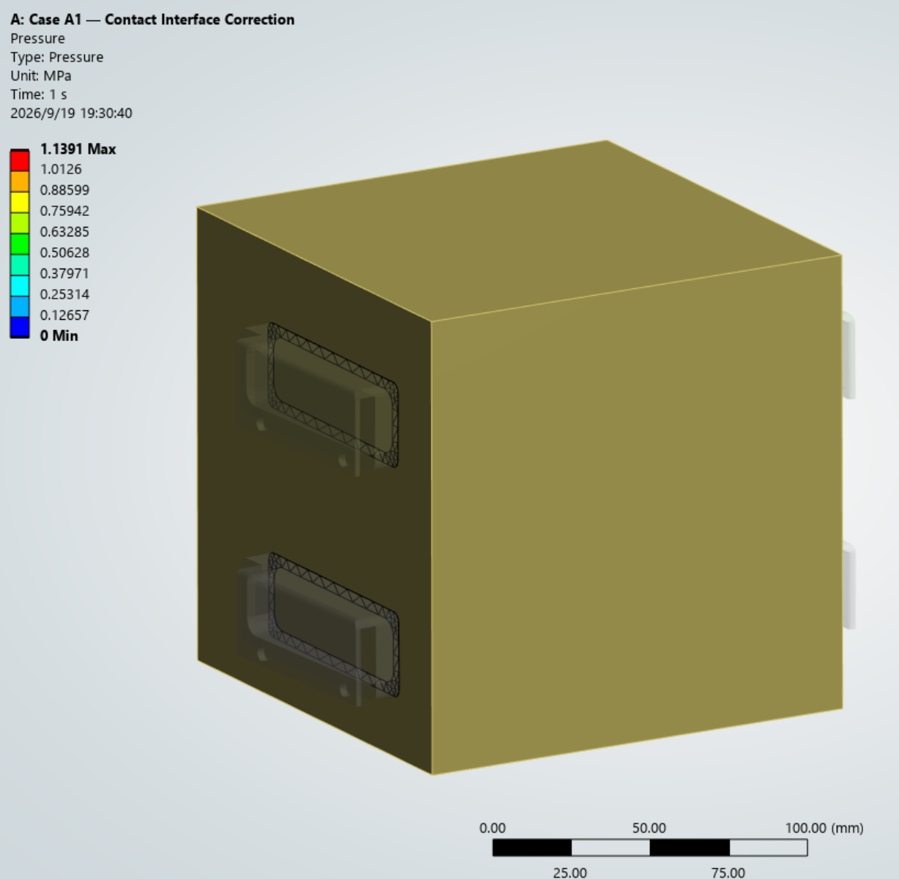
</p>

<p align="center"><em>Case A1 contact-pressure distribution after the 3° contact-face correction.</em></p>

---

## 4. Case A2 — Topology-Informed Jaw Plate Redesign

Topology optimization was carried out on a separate linearized jaw-plate model derived from the A1 load state.

### Optimization setup

- Design region: **Jaw Plate**
- Objective: **Minimize compliance**
- Mass constraint: **70% retained**
- Optimization method: **Mixable Density**
- Final CAD method: **Topology-informed manual redesign**

The raw density result was used as a **load-path reference**, not as final geometry. A clean CAD redesign was then returned to the complete nonlinear gripper assembly for final validation.

<p align="center">
  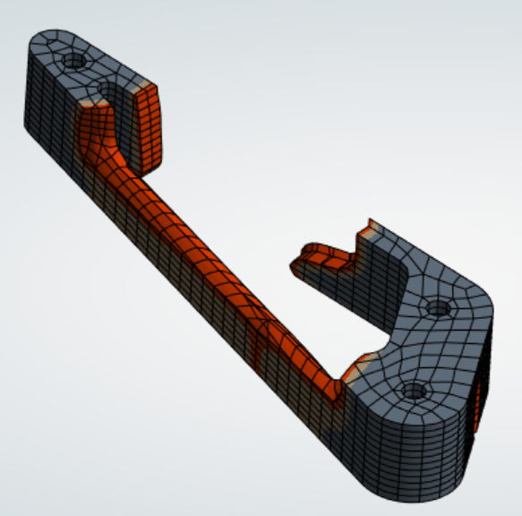
</p>

<p align="center"><em>Topology-density result used as a qualitative load-path guide for the jaw-plate redesign.</em></p>

### Jaw Plate CAD Redesign

<table>
<tr>
<td width="50%" valign="top">
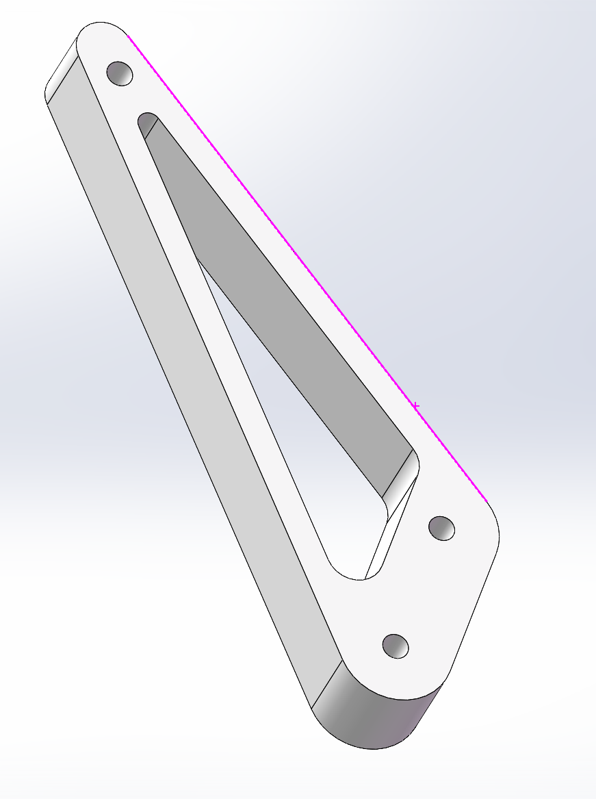
</td>
<td width="50%" valign="top">
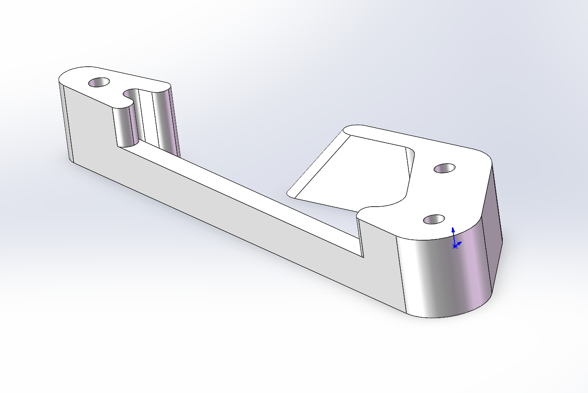
</td>
</tr>
<tr>
<td align="center"><strong>Original Jaw Plate</strong><br><em>40.10 g per part</em></td>
<td align="center"><strong>Final A2 Jaw Plate</strong><br><em>31.198 g per part (-22.2%)</em></td>
</tr>
</table>

The final CAD preserves the functional pivot and mounting interfaces while removing material from the low-demand interior region identified by the topology study. The resulting geometry was then revalidated in the complete nonlinear gripper assembly.

---

## 5. Final A2 Full-Assembly Validation

| Metric | Case A1 | Final A2 | Change |
|---|---:|---:|---:|
| Jaw plate mass / part | 40.10 g | **31.198 g** | **-22.2%** |
| Jaw plate max equivalent stress | 7.7262 MPa | **8.9109 MPa** | +15.3% |
| Actuator reaction force | 48.561 N | **49.848 N** | +2.65% |
| Max contact pressure | 1.1391 MPa | **0.57908 MPa** | **-49.2%** |
| Total contact area | 122.72 mm² | **287.179 mm²** | **+134.0%** |
| Global max equivalent stress | 16.782 MPa | **11.485 MPa** | **-31.6%** |
| Global max principal stress | 27.354 MPa | **14.537 MPa** | **-46.9%** |

Relative to the original baseline, the final jaw-plate stress is essentially unchanged (**8.9373 MPa → 8.9109 MPa**) despite the **22.2%** mass reduction.

<table>
<tr>
<td width="50%" valign="top">
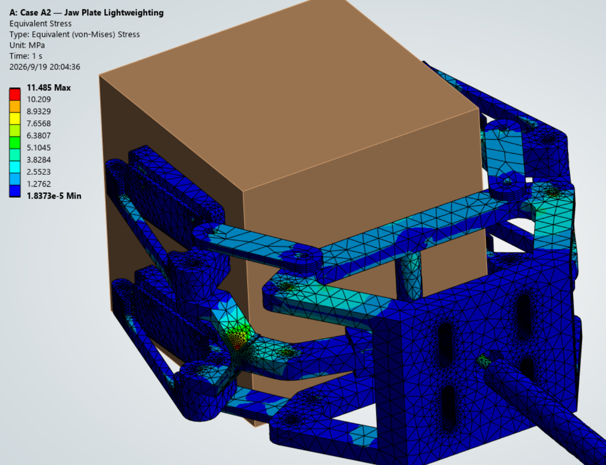
</td>
<td width="50%" valign="top">
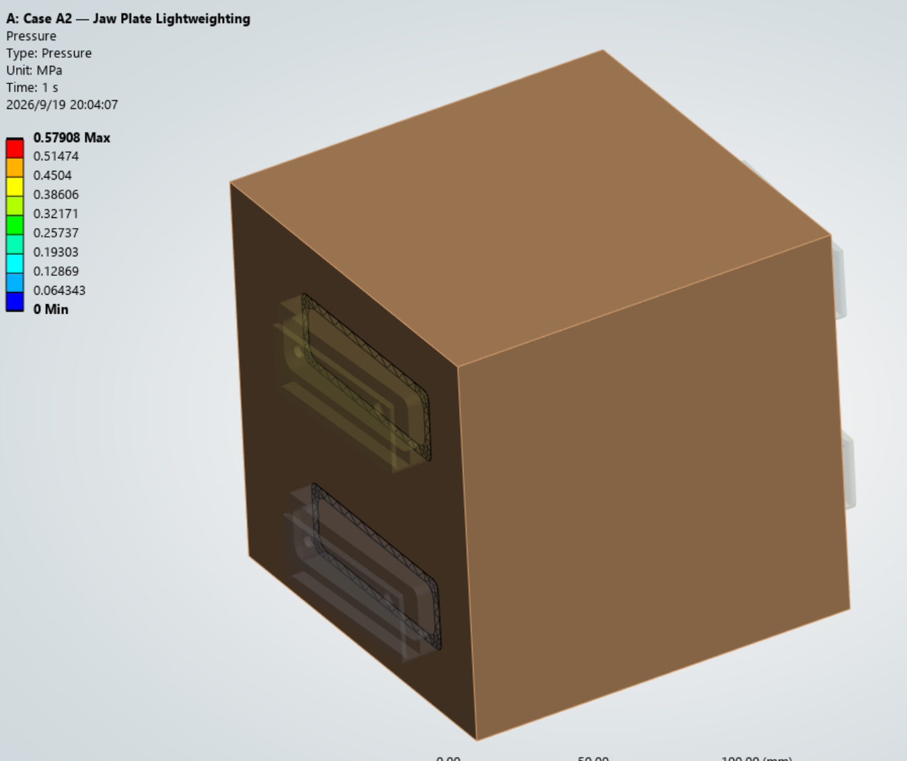
</td>
</tr>
<tr>
<td align="center"><em>Final A2 full-assembly equivalent stress.</em></td>
<td align="center"><em>Final A2 contact-pressure distribution.</em></td>
</tr>
</table>

See [docs/results.md](docs/results.md) for the full design-evolution summary.

---

## Engineering Takeaways

This project was structured as a design-validation workflow rather than as a single FEA run:

- characterize the nonlinear mechanism before redesign
- verify mesh sensitivity
- use the baseline result to choose an appropriate optimization target
- correct the contact interface before lightweighting
- use topology optimization as a design guide rather than final CAD
- validate the redesigned part in the complete nonlinear assembly

The actuation-link hotspot also demonstrates why component selection matters: not every low-volume region is a suitable candidate for material removal.

---

## Repository Structure

```text
pneumatic-gripper-fea/
├── README.md
├── RELEASE_NOTES.md
├── docs/
│   ├── methodology.md
│   └── results.md
├── assets/
│   ├── baseline/
│   ├── case-a1/
│   ├── topology/
│   └── final-a2/
├── results/
│   ├── README.md
│   └── summary.csv
├── cad/
│   ├── README.md
│   ├── baseline_gripper.STEP
│   ├── original_block.STEP
│   ├── case_a1_corrected_block.STEP
│   ├── original_jaw_plate.STEP
│   ├── final_a2_gripper.STEP
│   └── final_a2_jaw_plate.STEP
├── ansys/
│   └── README.md
└── .gitignore
```

The full ANSYS Workbench archive is approximately **900 MB** and is intentionally kept out of the normal Git history.

---

## Reproducibility

Portable CAD geometry is provided in the [`cad/`](cad/) directory as STEP files for the baseline, A1 contact-block correction, and final A2 design.

The preferred full ANSYS package is a Workbench archive (`.wbpz`) rather than a standalone `.wbpj`, because the latter depends on its associated project-data directory.

The final A2 archive is approximately **900 MB** and is distributed through GitHub Releases rather than committed directly to the repository.

**Release asset:** `pneumatic_gripper_case_A2_final.wbpz`  
**Release page:** [Latest release](https://github.com/Tonylo-lab/pneumatic-gripper-fea/releases/latest)  
**Direct archive download:** [pneumatic_gripper_case_A2_final.wbpz](https://github.com/Tonylo-lab/pneumatic-gripper-fea/releases/download/v1.0/pneumatic_gripper_case_A2_final.wbpz)

See [RELEASE_NOTES.md](RELEASE_NOTES.md) for the v1.0 archive contents.

---

## Software

- SolidWorks
- ANSYS Workbench / Mechanical 2026 R1
- ANSYS Discovery

---

## Scope and Limitations

This study uses a simplified isotropic material model for FDM PLA and prescribed actuator displacement because the actual pneumatic-cylinder force was not available. The rigid cube and frictionless jaw-block contact are modeling assumptions for design comparison rather than a complete experimental characterization of real gripping performance.
